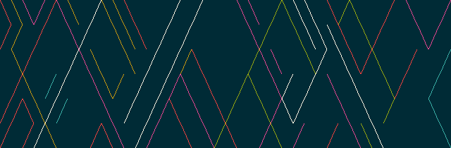
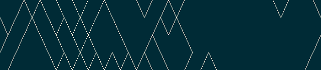
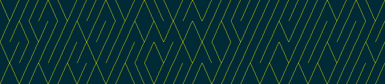

=========
pipesX.sh
=========

  *Animated pipes terminal screensaver at an angle.*

.. note on taking the screenshots

  Font is Inconsolata, font size 24 as in 16x35 pixel per character

  Image size is 640x210. A sample command, where terminal at +0+18,
  window border is 2, terminal is urxvt, seems to 2 pixels as padding:

  xsnap -region 640x210+$((2+2))+$((20+2)) -file doc/pipesX.png

  Screenshot of pipesX.sh, click to watch a screencast_ on YouTube.

.. _screencast: http://youtu.be/dITTlFPYVPA

.. contents:: **Contents**
   :local:
   :backlinks: top

How this started
================

In 2013, I modified the pipes.sh_ and it inspired me to create this version,
that is piping at an angle.

.. _pipes.sh: https://github.com/livibetter/pipes.sh

Installation
============

If you want to install, you can run:

.. code:: sh

  $ make install

By default, it installs to ``/usr/local``; for user home, you can run:

.. code:: sh

  $ make PREFIX=$HOME/.local install

Or any ``PREFIX`` you prefer.

The ``Makefile`` also provides ``uninstall`` target.

Options
=======

``-n [1-]``
-----------

Number of pipes (Default: 1).

``-t [#]``
----------

Types of pipes, can be used more than once (Default: 0).

.. note on taking the screenshots

  Font is Inconsolata, font size 24 as in 16x35 pixel per character

  Image size is 480x140. A sample command, where terminal at +0+18,
  window border is 2, terminal is urxvt, seems to 2 pixels as padding:

  xsnap -region 480x140+$((2+2))+$((20+2)) -file doc/pipesX.t#.png

+----------+-------------------------------+
| ``-t #`` | Charaters                     |
+==========+===============================+
| ``-t 0`` | ``╱╲``                        |
|          |                               |
|          | .. figure:: doc/pipesX.t0.png |
+----------+-------------------------------+
| ``-t 1`` | ``/\``                        |
|          |                               |
|          | .. figure:: doc/pipesX.t1.png |
+----------+-------------------------------+

``-i [float]``
--------------

Piping interval or maze generation interval. (Default: 0.05)

``-f [20-100]``
---------------

Framerate (Default: 75)

``-P [0-100]``
--------------

Probability of a turning pipe or of \ in maze generation. (Default: 25)

``-r LIMIT``
------------

Reset after x characters, 0 if no limit (Default: depending on screen size)

``-R``
------

Random starting point.

``-C``
------

No color.

.. note on taking the screenshot

  Font is Inconsolata, font size 24 as in 16x35 pixel per character

  Image size is 640x140. A sample command, where terminal at +0+18,
  window border is 2, terminal is urxvt, seems to 2 pixels as padding:

  xsnap -region 640x140+$((2+2))+$((20+2)) -file doc/pipesX.C.png

``-X``
------

Maze generation.

.. note on taking the screenshot

  Font is Inconsolata, font size 24 as in 16x35 pixel per character

  Image size is 640x140. A sample command, where terminal at +0+18,
  window border is 2, terminal is urxvt, seems to 2 pixels as padding:

  xsnap -region 640x140+$((2+2))+$((20+2)) -file doc/pipesX.X.png

``-h``
------

Help message.

``-v``
------

Print version number.

Copyright
=========

pipesX.sh is licensed under `the MIT License`__::

  Copyright (C) 2013 by Yu-Jie Lin

__ LICENSE
